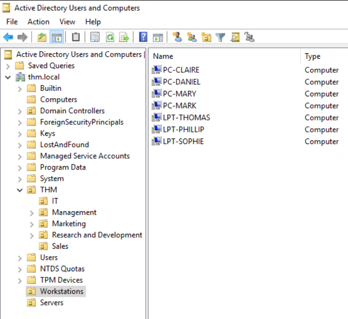
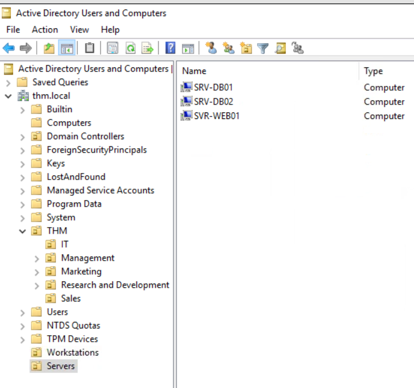

# Active Directory Fundamentals (TryHackMe Lab)

This project documents my hands-on work in **TryHackMe Cyber Security 101** and **Windows & Active Directory Fundamentals** labs.  
The focus was on learning how to configure and manage **Active Directory (AD DS)**, apply **Group Policy Objects (GPOs)**, manage **users, machines, groups, and OUs**, and simulate real-world IT administration tasks in a Windows domain environment.  

This type of environment is a core foundation in enterprise IT, where identity and access management, policy enforcement, and privilege delegation are critical to maintaining security and compliance.  
---

# Lab Checklist

# Part 1: Active Directory Basics

### Core Concepts
- **AD DS** acts as a catalogue that holds all network objects (users, groups, machines, printers, shares).  
- **Security Principals** (users, groups, machines) can be authenticated and assigned privileges.  
- By understanding how AD organizes objects, administrators can control access, enforce rules, and secure resources across an enterprise network.  

📸 Example: Viewing AD DS in the Domain Controller  
 

---

# Part 2: User & Machine Accounts

- Created new domain user accounts through **Active Directory Users and Computers (ADUC)**.  
This allows centralized management of employee identities, making authentication and authorization consistent across the domain.  

📸 Example: User creation process  

- Added users to **security groups** for role-based access control.  
Groups ensure easier permission management by assigning access rights once and applying them to multiple users.  

📸 Example: Adding users to groups  

- Verified both workstation and server objects in AD to ensure all machines were properly joined to the domain.  
This is crucial for applying policies, enforcing security rules, and maintaining centralized control.  

📸 Example: Computers and servers in AD  
  

 

---

# Part 3: Security Groups

- Created **security groups** to simplify permission management and align with best practices.  
Instead of assigning permissions to individual users, groups allow administrators to apply access rules to collections of users, reducing errors and improving efficiency.  

📸 Example: Group creation in AD  

---

# Part 4: Organizational Units (OUs)

- Organized users and computers into **Organizational Units (OUs)** for structured management.  
OUs make it possible to apply specific **Group Policy Objects (GPOs)** to certain departments, roles, or device types without affecting the entire domain.  

📸 Example: Computers not yet organized vs structured OUs  
  

 

- Applied **object deletion protection** to prevent accidental removals of critical OUs.  
This safeguard is important in large organizations where multiple administrators may have access and mistakes could disrupt business operations.  

📸 Example: Object deletion protection enabled  

---

# Part 5: Delegation of Control

- Delegated IT staff privileges for limited administrative actions (e.g., password resets, account unlocks).  
Delegation improves efficiency by allowing junior IT staff to handle routine tasks while keeping higher-level privileges restricted to admins.  

📸 Example: Delegation assigned to IT Support  

- Practiced using **PowerShell** for administrative tasks like password resets.  
Scripting and automation are critical in real-world IT environments to handle repetitive actions across large domains quickly and securely.  

📸 Example: Resetting password with PowerShell  

---

# Part 6: Group Policy Objects (GPOs)

- Enforced password complexity and account lockout policies to align with security baselines.  
This reduces the risk of weak or reused passwords being exploited by attackers.  

📸 Example: Password policy GPO  

- Restricted access to **Control Panel** for standard users to prevent misconfiguration of system settings.  
This is a common administrative control to reduce helpdesk tickets and ensure system integrity.  

📸 Example: Prohibit access Control Panel  

- Configured **auto-lock screen** after 5 minutes of inactivity to mitigate risks of unattended devices.  
This aligns with organizational security standards such as CIS and NIST.  

📸 Example: Auto-lock screen GPO applied  
  

 

- Linked GPOs across all OUs to ensure policies were consistently applied throughout the domain.  
This step confirmed that even newly added users and devices inherit the same baseline security controls.  

📸 Example: Linking GPOs to OUs  

---

# Skills Demonstrated

| Tools & Technologies             | Description                                        |
| -------------------------------- | -------------------------------------------------- |
| Active Directory Domain Services | Managing users, groups, and machines               |
| Group Policy Objects (GPOs)      | Applying domain-wide policies and baselines        |
| Windows Server (DC)              | Domain Controller setup and administration         |
| PowerShell                       | Used for user management and password resets       |
| Event Viewer                     | Log inspection and troubleshooting                 |
| Organizational Units (OUs)       | Logical structuring of AD objects                  |

 

| Security & IT Skills          | Description                                    |
| ----------------------------- | ---------------------------------------------- |
| Identity & Access Management  | Managing users, groups, and permissions        |
| Policy Enforcement            | Enforcing security baselines via GPOs          |
| Account Delegation            | Delegating control for IT support              |
| Log Monitoring                | Using Event Viewer to track AD activity        |
| Network Administration        | Understanding AD structure and domain objects  |

---

# Final Result

✔ Configured and managed Active Directory Domain Services (AD DS)  
✔ Created and managed **users, groups, and machine accounts**  
✔ Designed and implemented **OU structures** for scalable management  
✔ Applied **GPOs** to enforce enterprise security policies  
✔ Practiced **delegation of privileges** for IT support staff  
✔ Strengthened understanding of **enterprise identity and access management**  

